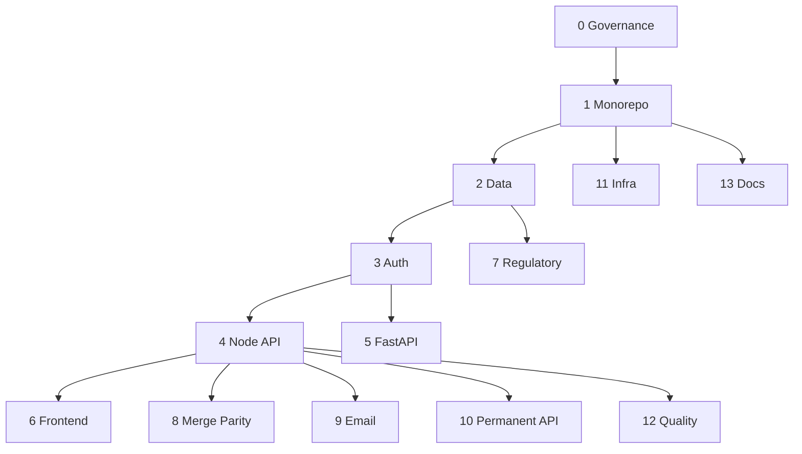

# AurexV4 — Work Breakdown Structure (Greenfield)

**Sources**: `README.md`, `CLAUDE.md`, `SPRINT_1-2_SPECIFICATION.md`, `SPRINT_1-2_IMPLEMENTATION_PLAN.md`, `SPRINT_1-2_TECHNICAL_ARCHITECTURE.md`, `FRESH_AUTH_ARCHITECTURE.md`, `ADM-055-Authentication-UX-Restoration.md`, `ADM-056-Systematic-Guardrails-Implementation.md`, `docs/PRODUCT_ROADMAP_2026-2030.md`, `docs/DOCUMENTATION_MASTER_INDEX_V1.0.md`, `docs/jira-tickets-emissions-targets-baselines.md`, `docs/MERGE_IMPLEMENTATION_PLAN.md`, `docs/DEVELOPER_ONBOARDING_GUIDE.md`, `EMAIL_INTEGRATION_INVESTIGATION_REPORT.md`, `SENDGRID_MIGRATION_COMPLETED.md`, `PERMANENT_API_SOLUTION_REPORT.md`, `WAVE3_COMPLETION_REPORT.md`, `deploy.wave3.yaml`  
**Jira site (reference)**: [AV4 board](https://aurigraphdlt.atlassian.net/jira/software/projects/AV4/boards/1450)  
**Conventions**: **Epic** → **Story** → **Task** → **Subtask**. IDs like `E1.3` are WBS codes only (not Jira keys until created).

---

## Session log

### 2026-04-23 — Sprint 2 completion + org hierarchy + deploy/ESLint cleanup

10 commits shipped to `main` and deployed to `aurex.in`:

- `db971c4` feat(sprint-2): analytics, baselines, targets, reports + auth/health polish — full Sprint 2 backend + frontend surface (analytics aggregations, baselines CRUD, targets with SBTi pathways + progress, async report generation).
- `69b2931` chore: migrate ESLint to v9 flat config, add schema smoke tests, fix pre-deploy gates — unblocks `pnpm lint` and `pnpm deploy:pre-check` (ADM-055 gates 1-4).
- `49c3428` chore: add .dockerignore to exclude node_modules from build context — shrinks build context, speeds CI.
- `8652d27` chore(deploy): align deploy-to-remote.sh with actual aurex.in layout — deploy script now matches host paths (ADM-043) and NGINX/web layout on the remote.
- `0d1a74a` fix: emissions entry not persisting + auth events silently dropped — fixes the Sprint 1 emissions write path and auth event logging.
- `01b5531` fix(sidebar): dropdown invisible — escape overflow clipping via portal — DashboardSidebar dropdowns now render via portal to bypass `overflow: hidden`.
- `5e23c9a` feat(orgs): parent/subsidiary hierarchy + optional rollup in analytics and reports — org hierarchy model, `parentOrgId` FK, subsidiary rollup in analytics + report generation.
- `03e696f` feat(ui): include-subsidiaries toggle on Analytics + Report Builder — UI controls surface the rollup flag.
- `9c6008d` fix(users): POST /users endpoint was missing — Add User returned 404 — closes the S1.2 gap; Add User flow on the frontend now works end-to-end.
- `c489ac1` fix(auth): requireRole now case-insensitive — RBAC middleware no longer rejects mixed-case role claims from JWT.

Sprint status after this session:

- **Sprint 1 (S1)**: shipped. S1.1, S1.2, S1.7, S1.8, S1.10 annotated in `WBS_FRONTEND_PORTAL_SPRINTS.md`.
- **Sprint 2 (S2)**: shipped. Entire epic annotated in `WBS_FRONTEND_PORTAL_SPRINTS.md`.
- **ADM**: ADM-058 appended to personal ADM log.

---

## 0. Program governance & delivery

| WBS | Type | Name | Notes (from docs) |
| --- | --- | --- | --- |
| 0.1 | Story | Delivery operating model | 11 quality gates, SPARC → deployment sequence (`CLAUDE.md`) |
| 0.1.1 | Task | Define gate owners & evidence | Sign-off + evidence paths per gate |
| 0.1.1.1 | Subtask | Gate checklist templates | Align with TICKET / deployment checklists |
| 0.1.2 | Task | Branching & release cadence | Monorepo `pnpm`/Turborepo (`CLAUDE.md`) |
| 0.2 | Story | Backlog hygiene | Labels: phase, component, regulation (CBAM/CSRD), risk |
| 0.3 | Story | Stakeholder reporting | Roadmap KPIs (`PRODUCT_ROADMAP_2026-2030.md`) |

---

## 1. Foundation — repository & developer platform

| WBS | Type | Name | Notes |
| --- | --- | --- | --- |
| 1.1 | Epic | Monorepo bootstrap | `apps/`, `packages/`, `infrastructure/`, `config/`, `tests/` layout |
| 1.1.1 | Story | Workspace tooling | `pnpm-workspace`, `turbo.json`, root scripts |
| 1.1.1.1 | Subtask | Align `package.json` scripts with `CLAUDE.md` quick start | `dev`, `build`, `test`, `lint`, `typecheck` |
| 1.1.1.2 | Subtask | Shared TS config | `tsconfig.base.json`, package references |
| 1.1.2 | Story | Local environment | `.env.example`, secrets policy, no secrets in repo |
| 1.1.2.1 | Subtask | Document env matrix | API, web, DB, Redis, vault, email |
| 1.1.3 | Story | Editor & hooks | `.editorconfig`, Husky/commit conventions (`.commitlintrc`, `.husky`) |
| 1.2 | Epic | Package graph | `@aurex/web`, `@aurex/api`, `@aurex/database`, `@aurex/shared`, domain packages |
| 1.2.1 | Story | Internal package boundaries | Carbon / water / biodiversity packages (`CLAUDE.md`) |
| 1.2.2 | Story | Path aliases & build order | Turborepo pipeline |

---

## 2. Data layer

| WBS | Type | Name | Notes |
| --- | --- | --- | --- |
| 2.1 | Epic | PostgreSQL + Prisma | Multi-tenant, migrations, studio (`CLAUDE.md`) |
| 2.1.1 | Story | Schema governance | Naming, indexes, RLS strategy (per master index) |
| 2.1.2 | Story | Migrations & seed | `pnpm db:migrate`, seed for dev/staging |
| 2.1.3 | Story | Tenant isolation model | Schema/strategy per architecture index |
| 2.2 | Epic | Blockchain data model | Sprint 1–2 spec: ACCT, settlements, transactions |
| 2.2.1 | Story | Prisma models | `BlockchainTransaction`, `LiabilitySettlement`, `CarbonCreditTransaction`, `ACCTBalance`, `BlockchainAddress` |
| 2.2.1.1 | Subtask | FKs & indexes | As in implementation plan SQL sketches |
| 2.2.2 | Story | Migration rollout | Zero-downtime strategy, backfill |
| 2.3 | Epic | Analytics & supplier extensions | Reduction initiatives, supplier analytics (`SPRINT_1-2_SPECIFICATION.md`) |
| 2.4 | Epic | Emissions targets & baselines | Mirror proven breakdown (`docs/jira-tickets-emissions-targets-baselines.md`) |
| 2.4.1 | Story | Schema: baselines, targets, progress | EmissionsBaseline, EmissionsTarget, TargetProgress |
| 2.4.2 | Story | Baseline API CRUD + RBAC | Zod, pagination, tests |
| 2.4.3 | Story | Target API + SBTi validation | Pathways 1.5°C / WB2°C / 2°C |
| 2.4.4 | Story | Baseline dashboard UI | Modals, charts, React Query |
| 2.4.5 | Story | Target wizard UI | 4-step flow, live validation |
| 2.4.6 | Story | Progress service | Trajectory, variance, aggregation |
| 2.4.7 | Story | Alerts engine + UI | Rules, severity, notification integration |
| 2.4.8 | Story | Integration & E2E | Full flow baseline → target → progress → alert |

---

## 3. Identity, authN/Z, sessions

| WBS | Type | Name | Notes |
| --- | --- | --- | --- |
| 3.1 | Epic | Fresh universal auth | `FRESH_AUTH_ARCHITECTURE.md`, ADM-055/056 |
| 3.1.1 | Story | DB: users, sessions, roles, auth_events, MFA | Device fingerprinting |
| 3.1.2 | Story | FastAPI auth service | JWT RS256, rotation, blacklist, rate limits, lockout |
| 3.1.3 | Story | Frontend AuthProvider | httpOnly cookies, refresh, idle logout |
| 3.1.4 | Story | MFA | TOTP, email verification, backup codes |
| 3.1.5 | Story | RBAC enforcement | Middleware across Node + Python boundaries |
| 3.1.6 | Story | Auth UX restoration | ADM-055 flows, error states, accessibility |
| 3.1.7 | Story | Systematic guardrails | ADM-056: route guards, audit, abuse detection |
| 3.1.8 | Story | Security test suite | OWASP-oriented cases (`FRESH_AUTH_ARCHITECTURE.md`) |

---

## 4. Node/Express API (`apps/api`)

| WBS | Type | Name | Notes |
| --- | --- | --- | --- |
| 4.1 | Epic | API core | Controllers, routes, validation, OpenAPI |
| 4.1.1 | Story | Environment validation | Re-enable strict startup post-`.env.production` (sprint spec) |
| 4.1.2 | Story | Repository layer | Fix Scope3 factory, type-safe repositories |
| 4.1.3 | Story | Trial / dashboard metrics | Carbon assessments count, exports (TODOs in spec) |
| 4.1.4 | Story | PDF reporting | Carbon offsetting PDF path (`SPRINT_1-2_SPECIFICATION.md`) |
| 4.1.5 | Story | Supplier data management | Model + controller completion |
| 4.2 | Epic | Blockchain controllers | ACCT purchase/retire/transfer — unblock 501s |
| 4.2.1 | Story | Web3 service integration | Contract interface, tx history |
| 4.2.2 | Story | Settlement & credit flows | End-to-end with Prisma models |

---

## 5. Python FastAPI (`aurex-backend` / `apps` integration)

| WBS | Type | Name | Notes |
| --- | --- | --- | --- |
| 5.1 | Epic | Service boundaries | Shared auth, tracing, error format |
| 5.1.1 | Story | Deployable image & config | Align with monorepo docker patterns |
| 5.1.2 | Story | Contract tests vs Node API | Prevent drift |

---

## 6. Frontend (`apps/web`, shared UI)

| WBS | Type | Name | Notes |
| --- | --- | --- | --- |
| 6.1 | Epic | Tenant web shell | Vite, routing, design system (`packages/ui`) |
| 6.1.1 | Story | Tenant theming & i18n hooks | Roadmap: supplier portal languages |
| 6.1.2 | Story | Performance budgets | <100 ms p95 alignment with org goals |
| 6.2 | Epic | Module UIs | CarbonTrace, HydroPulse, SylvaGraph surfaces per roadmap |
| 6.3 | Epic | CBAM & compliance UX | Release 1.1 UX (embedded emissions, certificates, dashboards) |

---

## 7. Regulatory product streams (roadmap-aligned)

| WBS | Type | Name | Notes |
| --- | --- | --- | --- |
| 7.1 | Epic | R1.1 CBAM “ready” | Calculator, certificates, quarterly reporting, factors, classifier, alerts |
| 7.1.1 | Story | EU emission factors dataset | 27 members, update pipeline |
| 7.1.2 | Story | Product category classifier | Aluminum, cement, fertilizer, iron/steel, electricity, hydrogen |
| 7.1.3 | Story | Compliance timeline & alerts | Notifications integration |
| 7.2 | Epic | R1.2 CSRD templates | Materiality wizard, ESRS E1–E5, S1–S4, G1, double materiality UI |
| 7.3 | Epic | R1.3 AI estimation engine | NAICS factors, spend-based, hybrid, confidence, quality dashboard |
| 7.3.1 | Story | Model training pipeline | EPA, Exiobase, DEFRA |
| 7.3.2 | Story | Inference API | Real-time + monitoring |
| 7.4 | Epic | R2.1 Scope 3 supplier portal | Token links, campaigns, validation, scoring, bulk CSV/API |

---

## 8. Merge & parity (V3 → Neutralis / AurexV4)

| WBS | Type | Name | Notes |
| --- | --- | --- | --- |
| 8.1 | Epic | Program: merge execution | `MERGE_IMPLEMENTATION_PLAN.md` timeline |
| 8.1.1 | Story | Feature parity checklist | Critical V3 routes |
| 8.1.2 | Story | Data migration | Zero-loss validation, rollback |
| 8.2 | Epic | BRSR module port | Models `BRSRReport`, indicators, PDF/Excel |
| 8.3 | Epic | Carbon marketplace / offsetting parity | Weeks 5–8 scope in merge plan |
| 8.4 | Epic | Cutover & adoption | <4 h downtime, 95% migration in 30 days KPIs |

---

## 9. Notifications & email

| WBS | Type | Name | Notes |
| --- | --- | --- | --- |
| 9.1 | Epic | Email platform | Investigation + SendGrid migration docs |
| 9.1.1 | Story | Transactional templates | Auth, alerts, supplier campaigns |
| 9.1.2 | Story | Suppression & compliance | Bounce handling, unsubscribe where required |
| 9.1.3 | Story | Load & failure tests | Provider failover |

---

## 10. Permanent API / integration hardening

| WBS | Type | Name | Notes |
| --- | --- | --- | --- |
| 10.1 | Epic | API reliability program | `PERMANENT_API_SOLUTION_REPORT.md` themes |
| 10.1.1 | Story | Idempotency & rate limits | External partners |
| 10.1.2 | Story | Versioning & deprecation | `/api/v1` consistency |
| 10.1.3 | Story | Runbooks | Incident response for API tier |

---

## 11. Infrastructure & operations

| WBS | Type | Name | Notes |
| --- | --- | --- | --- |
| 11.1 | Epic | Container platform | Docker, K8s manifests (`infrastructure/`) |
| 11.1.1 | Story | Secrets: OpenBao (KMS) | J4C: OpenBao = KMS; Harbor = image registry. Vault‑API store; prod secrets (not committed) |
| 11.2 | Epic | Observability | Prometheus, Grafana, Loki, OpenTelemetry |
| 11.3 | Epic | CI/CD | GitHub Actions: test, SAST, DAST, deploy, rollback |
| 11.3.1 | Story | Reinstate env validation in pipeline | Link to API epic 4.1.1 |
| 11.4 | Epic | Wave 3 deployment | `deploy.wave3.yaml`, `WAVE3_COMPLETION_REPORT.md` patterns |
| 11.4.1 | Story | Environment-specific values | dev/staging/prod matrix |
| 11.5 | Epic | Auto-scaling, LB, Redis DR | Docs: `CONTAINER_AUTO_SCALING.md`, `LOAD_BALANCING_CONFIGURATION.md`, `REDIS_FAILOVER_CONFIGURATION.md` (create stories per doc) |

---

## 12. Quality, security, compliance testing

| WBS | Type | Name | Notes |
| --- | --- | --- | --- |
| 12.1 | Epic | TDD mandate | RED → GREEN → REFACTOR; coverage ≥92% target |
| 12.2 | Epic | Static analysis | ESLint, TS, Sonar (`sonar-project.properties`) |
| 12.3 | Epic | Dynamic & performance | k6/load, memory; p95 <100 ms |
| 12.4 | Epic | Security | SAST/DAST, OWASP, dependency scanning |
| 12.5 | Epic | E2E & compliance suites | Playwright, `e2e-compliance-test.js`, security tests in repo |

---

## 13. Documentation & enablement

| WBS | Type | Name | Notes |
| --- | --- | --- | --- |
| 13.1 | Epic | Living documentation | `LIVING_DOCUMENTATION.md`, master index categories |
| 13.1.1 | Story | Architecture & ADR set | `docs/architecture`, `docs/adr` |
| 13.1.2 | Story | API docs | OpenAPI publish pipeline |
| 13.1.3 | Story | Runbooks & audits | `docs/runbooks`, `docs/audits` |
| 13.2 | Epic | Developer onboarding | `DEVELOPER_ONBOARDING_GUIDE.md` → tasks for day-1/ week-1 |

---

## 14. Cross-cutting dependency highlights



---

## Jira mapping cheat sheet

| WBS epic | Suggested Jira Epic summary | Primary components |
| --- | --- | --- |
| 0 | Program governance & delivery | Process |
| 1 | Monorepo & developer platform | Tooling |
| 2 | Data layer & Prisma | Database |
| 3 | Identity & access | Security |
| 4 | Node/Express API | Backend |
| 5 | FastAPI services | Backend |
| 6 | Web applications | Frontend |
| 7 | Regulatory roadmap (CBAM/CSRD/AI/Scope3) | Product |
| 8 | V3 merge & parity | Platform |
| 9 | Notifications & email | Integration |
| 10 | Permanent API hardening | Backend |
| 11 | Infrastructure & operations | DevOps |
| 12 | Quality & security testing | QA |
| 13 | Documentation & onboarding | Docs |

**Issue types**: Use your project’s hierarchy (e.g. Epic → Story → Sub-task). Tasks in this WBS can be **Tasks** or **Stories** depending on whether the team tracks story points only on stories.

---

## Pushing this backlog into Jira

1. **Create the Jira project** (empty Scrum/Kanban or your template) in Jira admin and note the **project key** (for example `AV4` or a new key for a greenfield board).
2. Confirm **issue type names** match flags on the seed script (`Epic`, `Story`, `Sub-task` are defaults; your site may use `User Story`, `Task`, etc.).
3. For **company-managed** projects, discover **Epic Link** custom field id and pass `--epic-link-field` (see docstring in `scripts/jira/seed_backlog.py`).
4. Load values from your local **`credentials.md`** (gitignored; see `credentials.example.md`) and run:

```bash
# Copy export lines from credentials.md (gitignored) into your shell, then:
export JIRA_BASE_URL="https://aurigraphdlt.atlassian.net"
export JIRA_USER_EMAIL="you@example.com"
export JIRA_API_TOKEN="..."            # Atlassian API token
export JIRA_PROJECT_KEY="AV4"        # your project key
python3 scripts/jira/seed_backlog.py --dry-run
python3 scripts/jira/seed_backlog.py
```

Regenerate `scripts/jira/backlog_seed.json` from this document after edits:

```bash
python3 scripts/jira/wbs_to_backlog.py
python3 scripts/jira/seed_backlog.py --dry-run
```

Then create issues in Jira (requires `JIRA_*` env vars in `credentials.md`). `seed_backlog.py` prints counts; one run creates **all** epics, stories, and sub-tasks from the generated JSON.

---

## What was not in-repo locally

This WBS was synthesized from the **AurexV4 GitHub** documentation set (your Cursor workspace did not yet contain a full clone). After `git clone`, reconcile this document with any newer files under `docs/` and `.claude/docs/`.
